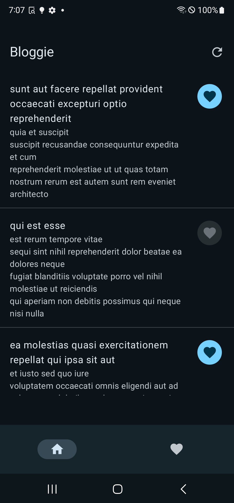

# Bloggie Project

Welcome to **Bloggie** - a sleek and modern blog app designed with the latest Android technologies to provide a seamless and enjoyable reading experience. Bloggie leverages the power of Jetpack Compose for a stunning UI, Hilt for dependency injection, MVVM architecture for maintainable and testable code, Retrofit for API interactions, and Room for local data storage.

## Features

- **Beautiful UI**: Built with Jetpack Compose to ensure a smooth and intuitive user interface.
- **Efficient Dependency Injection**: Hilt simplifies dependency injection, making the codebase more modular and easier to manage.
- **Robust Architecture**: MVVM pattern ensures a clean separation of concerns, facilitating easy maintenance and testing.
- **Seamless API Integration**: Retrofit handles all API calls, fetching data from the reliable JSONPlaceholder service.
- **Local Storage**: Room persists your favorite blog posts, allowing offline access and a responsive user experience.

## Tech Stack

- **Jetpack Compose**: For building the user interface.
- **Hilt**: For dependency injection.
- **MVVM (Model-View-ViewModel)**: For a clean and maintainable architecture.
- **Retrofit**: For making network requests.
- **Room**: For local database management.

## Screenshots


*Home Screen showing the latest blog posts.*


*Favorite Posts screen where users can see their saved articles.*

## Installation

To get a local copy up and running, follow these simple steps:

1. **Clone the repository**:
   ```sh
   git clone https://github.com/gondaimgano/bloggie.git
